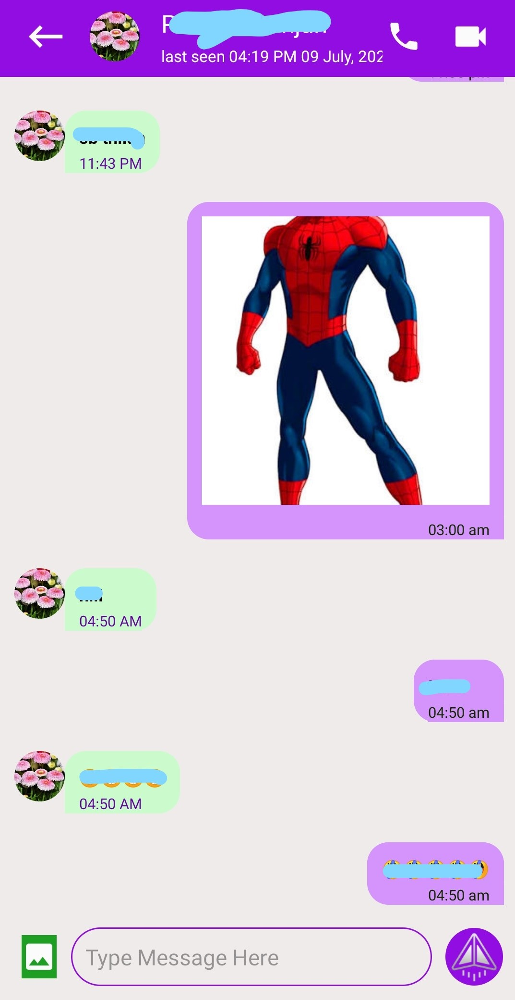
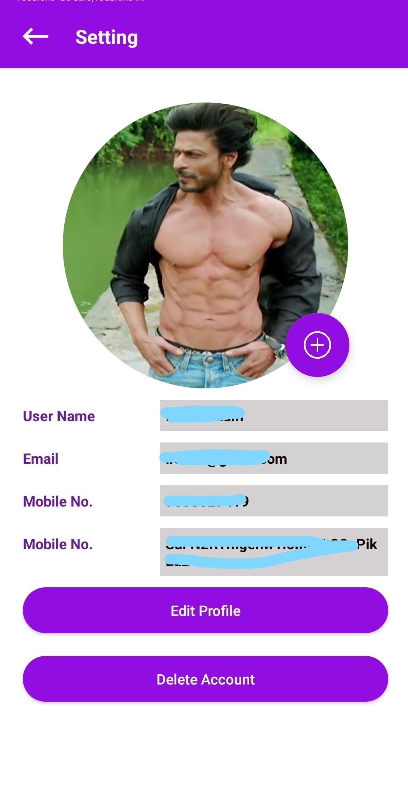
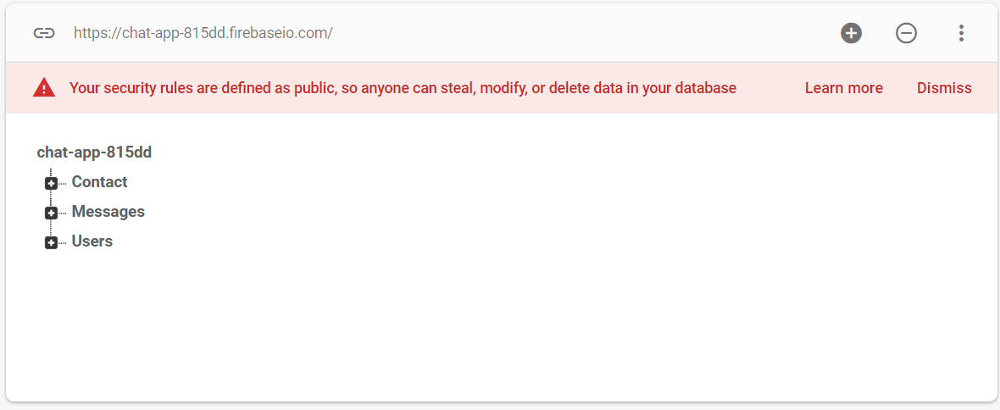

# Chat-App
Simple chat application

# Demo

List of friends

Chatting with friend

User Profile

# Overview

This is a simple chat application implement on Android Studio platform with the help of programming language java.
The XML is used for creating GUI in this app.

# Technical Aspect

This project implement on android studio and language used java. 
On frontend the XML is used for making GUI and java used for provide functionality in application. 
On the backend Firebase is used for database. The firebase is a realtime database which provide by Google.

# Installation

In this project Android Studio 3.6.0.0 used 
Some dependencies used for making this application which is:
<ul>
<li>
  Some dependencis of firebase :
  
  <ol>
    <li>'com.google.firebase:firebase-core:17.4.0'</li>
    <li>'com.google.firebase:firebase-auth:19.3.1'</li>
    <li>'com.google.firebase:firebase-database:19.3.0'</li>
    <li>'com.google.firebase:firebase-storage:19.1.1'</li>
  </ol>
  
</li>

<li>
  For circular image view : 
  'de.hdodenhof:circleimageview:3.1.0'
</li>

<li>
  For image cropping : 
  'com.theartofdev.edmodo:android-image-cropper:2.8.+'
</li>

<li>
  For loading image from device : 
  'com.squareup.picasso:picasso:2.71828'
</li>
</ul>

# Firebase architature

